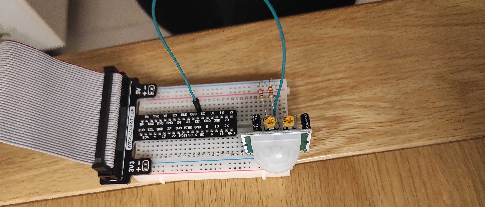

# Forget-iT

A simple Iot project using a raspberry pi 4b to detect an object using a BLE beacon and a PIR motion senson.


## Concept: 
Alert user via LED and a phone notification whether they have their key items(keys,wallet etc.) with them as they are leaving their home through the front door.

A BLE beacon is attached to an item(key,wallet etc). The raspberry pi with the senseHAT and PIR motion sensor is placed near the front door.

As the user approaches the front door to leave, the item is detected via the BLE beacon and the user is detected via the PIR motion sensor. Once both these are triggered, a green LED display is shown on the senseHAT and a notification is sent to the user's Blynk App on their smartphone that it is safe to leave.

Two methods of detection(PIR and BLE beacon) were used to avoid triggering a green LED when the item is left close to the front door when no-one is around.

## Requirements:
* Raspberry pi 4b (with Raspberry Pi OS also known as Raspbian) <br>
* Breakout board <br>
* PIR motion sensor module (https://thepihut.com/products/pir-motion-sensor-module) <br>
* 3 male-to-female jumper wires
senseHAT (https://thepihut.com/products/raspberry-pi-sense-hat-astro-pi) <br>
* BLE beacon(able to be configured)<br>
* Smartphone(to access Blynk app)<br><br>


# Packages and Dependencies Requirement

Python version above 3.4 is recommended.<br>

* Install blynk library. <br>
``` sudo pip install blynklib```<br>

* Install dotenv.<br>
```sudo pip install python-dotenv```<br>

* Create a blynk account and add your raspberry pi to your account.
* Fill in .env file with your device information.<br>

``` 
BLYNK_TEMPLATE_ID ="YOUR TEMPLATE ID"
BLYNK_DEVICE_NAME ="YOUR DEVICE NAME"
BLYNK_AUTH_TOKEN ="YOUR BLYNK AUTH TOKEN" 
```

* Download Bluetooth packages
```
sudo apt-get install bluetooth libbluetooth-dev
sudo pip install pybluez
```
* Enable BLE detection<br>

Go to: <br> ``` cd /lib/systemd/system ```

Open: <br> ``` bluetooth.services ```

Add: <br> ```--experimental```

after text: <br> ``` ExecStart=/usr/local/libexec/bluetooth/bluetoothd ```

Restart the Raspberry pi

<br>

# Installation

## Blynk account

* Create datastreams in your Blynk account as shown in the image below.<br>


* Create a visual template in your Blynk app as shown in the image below. <br>


* Create an automation in your Blynk app as shown in the image below. <br>


## Breadboard

* Connect the senseHAT to the raspberry pi.
* Use a breakout board to connect the GPIO pins to a breadboard.<br>


* Place the PIR motion sensor on the breadboard supplying 5V power and connecting the output datastream to GPIO pin 7.



## Running script

Run script by typing in the Pi terminal in the script directory:

``` sudo python3 blynk.py ```
